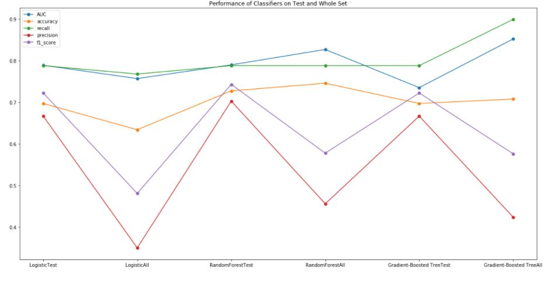

# Sparkify-Project


Blog Post of this project can be found at <br>
https://burgercewu.medium.com/never-lose-any-one-sparkify-user-churn-prediction-challenge-using-pyspark-7ab67ac080d4

## Motivation
In this project, we try to capture user intention to churn (which means cancelling the whole service) using user activity log from Sparkify, a company providing music service. Our goal is to predict whether a usr is at risk of churning is critical for company providing services nowadays. If we could accurately predict potentially churning users, we could provide promotion or special offer to those users to have them turn their mind.

## Introduction
In order to get better efficiency, we apply pyspark, which is a Spark API designed for Python as our framework. In our analysis, we follow the pipeline as follows:
- Data cleaning (Dropduplicate and remove null)
- Exploratory data analysis (Population and churned user group exploration)
- Feature engineering (Create user based features using activity logs)
- Modeling (Three candidates chosen, with paramgrid and crossvalidator for tuning hyper parameter)
- Evaluation (accuracy, recall, precision and f1_score)
- Conclusion

## Dataset
In this notebook, we use a subset of the full dataset for modeling. The schema of this dataframe is as below.
```
|-- artist: string (nullable = true) 
|-- auth: string (nullable = true) 
|-- firstName: string (nullable = true) 
|-- gender: string (nullable = true) 
|-- itemInSession: long (nullable = true) 
|-- lastName: string (nullable = true) 
|-- length: double (nullable = true) 
|-- level: string (nullable = true) 
|-- location: string (nullable = true) 
|-- method: string (nullable = true) 
|-- page: string (nullable = true) 
|-- registration: long (nullable = true) 
|-- sessionId: long (nullable = true) 
|-- song: string (nullable = true) 
|-- status: long (nullable = true) 
|-- ts: long (nullable = true) 
|-- userAgent: string (nullable = true) 
|-- userId: string (nullable = true) 
```
## Libraries Used
- re (Regular Expression)
- pyspark (Spark interface for Python)
- pandas (Dataframe manipulation)
- matplotlib (Plotting)
- seaborn (Advanced Plotting)

## Files and Folders
- images(image storage)
- Sparkify.ipynb (Notebook for the project)
- Sparkify.html (HTML for the Notebook)

## Summary
We have to first deal with dataset imbalance problem aftre data preprocessing. We create sub_dataset with fairly reasonable positive and negative label ratio before heading to modeling. After modeling of our three candidate (Logistic Regression, Random Forest and Gradient-Boosted Tree), we finally get decent performance of classification on our test set with accuracy and f1_scroe close to 0.75. Subsequently, we predict with the whole dataset and found that the performance drop a lot. We think that data size is a major issue because with hundreds of user data our analysis will not be representative of the population.

Below is the result of three classifer predcting test set and whole set.



## Acknowledgement
Special thank to Udacity for providing the dataset and training for skills required to complete this project
Blog Post can be found here: https://burgercewu.medium.com/never-lose-any-one-sparkify-user-churn-prediction-challenge-using-pyspark-7ab67ac080d4
